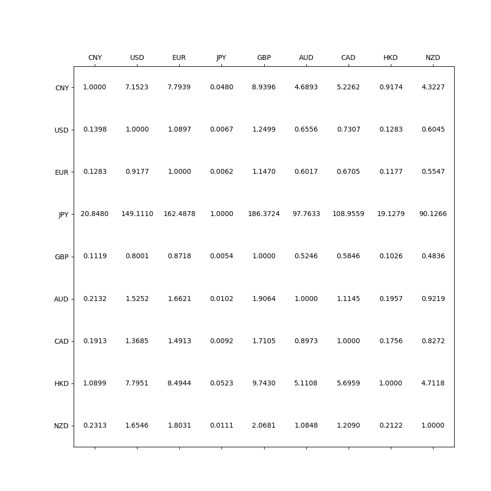

## Cross Currency Arbitrage Detector

### Description

This is assigment of the course "Algorithm Design and Analysis" at CJLU - AUT Joint BCIS Program 2023.

This project implements a program that detects arbitrage opportunities in currency exchange rates.

### Quick Start

1. Clone the repository
2. Run the program
    - Install the required libraries:
      ```pip install -r requirements.txt```
    - Run the program:
      ```python main.py```
3. Check the output result
    - The program will output the result to the console.
      
    - The program will request and generate the real world exchange rate matrix as input.
      
      - According to the exchange rate, we can simply find that there is exists arbitrage opportunities.
      - It is clear that the program calculate and print out potential arbitrage opportunities exchange path.
    - For generated currency tables (test case 1 & 2), matrix is in the 'test_case_generator.py'
      - The program out put as expected.
      - test case 1 (same as Assignment document)
        - output the arbitrage path
      - test case 2
        - output there is no arbitrage path

### Program Design Details

    In this project, we implement the shortest path algorithm.

    By using Bellman-Ford algorithm, we implement the function of detecting arbitrage opportunities in a currency exchange system.

    
    In this project, we test our implemention by passing test cases.
    
    Our test cases include two genrated test cases, and real world currency exchange rate.
    
    All real world datas are requested from exchangeratesapi.io, and we save json file as cache.

    
    In this project, we read the cache json file and use numpy to convert to currency exchange rate matrix.
    
    In our main function, we use matrix to storage the weight of currency exchange graph.
    
    By using Bellman - ford algorithm, we detect negatice cycle and use array to record the predecessor node information.

### Algorithm

The algorithm used in this program is Bellman-Ford algorithm, which is a single-source shortest path algorithm.
The algorithm is used to detect negative cycles in the graph, which means there exists arbitrage opportunity in the
currency exchange system.

The main idea of Bellman-Ford algorithm is to relax all edges for |V| - 1 times, where |V| is the number of vertices in
the graph.
The state transition equation is:
$$ d[v] = min(d[v], d[u] + w(u, v)) $$
where d[v] is the shortest distance from source vertex to vertex v, d[u] is the shortest distance from source vertex to
vertex u, w(u, v) is the weight of edge (u, v).

### External Liberal Usage

The program is written in Python 3.9.18, using the following libraries:

- requests
- numpy
- matplotlib

### Project Structure

```
.
├── README.md
├── data    # cache folder for exchange rate data
│   ├── 2023-11-18.json
│   ├── 2023-11-22.json
│   ├── 2023-11-23.json
│   └── xxxx-xx-xx.json
├── main.py # main program
├── requirements.txt
└── util
    ├── json_matrix_convert.py  # convert json data to matrix and vice versa
    ├── json_persistence.py    # save and load json data
    |── plot.py   # draw matrix
    ├── request_exchange_rate.py  # request exchange rate data from exchangeratesapi.io
    ├── test_case_generator.py # generate test cases
    └── time_util.py   # time utility
```
    